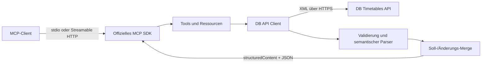

# Architektur

## Komponenten

- `src/server.ts` erzeugt eine unabhängige MCP-Serverinstanz und registriert Fähigkeiten.
- `src/transport.ts` trennt stdio von stateless Streamable HTTP.
- `src/api/timetableApi.ts` kapselt Authentifizierung, Timeout, HTTP-Fehler und Endpunkte.
- `src/api/timetableParser.ts` validiert XML und übersetzt DB-Codes in das öffentliche Modell.
- `src/tools/` und `src/resources/` definieren MCP-Schemas, Beschreibungen und Ergebnisse.

## Transportentscheidungen

stdio ist der Standard für lokale, vom Client gestartete Prozesse. Der Logger schreibt ausschließlich nach `stderr`, damit jede Zeile auf `stdout` eine gültige MCP-Nachricht bleibt.

Für Remote-Betrieb verwendet der Server den modernen Streamable-HTTP-Transport. Er ist stateless, weil die Fahrplanwerkzeuge keine serverseitigen Sessions benötigen. Das vereinfacht horizontale Skalierung und verhindert wachsenden In-Memory-Zustand. Legacy HTTP+SSE wird nicht neu angeboten; alte Konfigurationswerte werden auf Streamable HTTP migriert.

## Sicherheit

- Zugangsdaten werden ausschließlich aus Umgebungsvariablen bzw. `.env` gelesen und nie geloggt.
- Alle dynamischen Pfadwerte werden mit `encodeURIComponent` als einzelnes URL-Segment kodiert.
- Zod begrenzt Tool-Eingaben; API-Aufrufe haben einen konfigurierbaren Timeout.
- HTTP bindet standardmäßig nur an `127.0.0.1`. Wildcard-Bindings erfordern `ALLOWED_HOSTS` gegen DNS-Rebinding.
- Der Container läuft als `node`, besitzt im Compose-Profil keine Linux-Capabilities und ein read-only Root-Dateisystem.
- Ein öffentlich erreichbarer Transport gehört hinter einen authentifizierenden TLS-Reverse-Proxy; der Server selbst speichert keine Nutzeridentitäten.

## Betrieb und Rollback

Der Healthcheck prüft nur Prozess- und MCP-Bereitschaft und verbraucht kein DB-API-Kontingent. Releases sollten mit einer unveränderlichen Image-Version markiert werden. Ein Rollback erfolgt auf den vorherigen Git-Tag bzw. das vorherige Container-Tag; Datenmigrationen sind nicht erforderlich.
