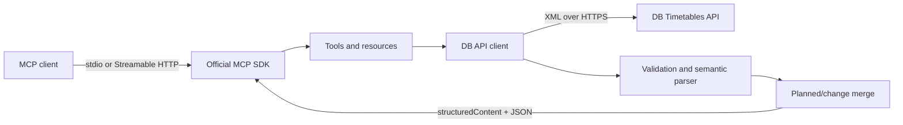

# Architecture

## Components

- `src/server.ts` creates an independent MCP server instance and registers capabilities.
- `src/transport.ts` separates stdio from stateless Streamable HTTP.
- `src/api/timetableApi.ts` encapsulates authentication, timeouts, HTTP errors, and endpoints.
- `src/api/timetableParser.ts` validates XML and translates DB codes into the public model.
- `src/tools/` and `src/resources/` define MCP schemas, descriptions, and results.

## Transport decisions

stdio is the default for local processes started by the client. The logger writes to `stderr` only, so every line on `stdout` stays a valid MCP message.

For remote operation the server uses the current Streamable HTTP transport. It is stateless because the timetable tools need no server-side sessions. That simplifies horizontal scaling and avoids growing in-memory state. Legacy HTTP+SSE is not offered again; old configuration values are migrated to Streamable HTTP.

## Security

- Credentials are read from environment variables or `.env` only and are never logged.
- Every dynamic path value is encoded with `encodeURIComponent` as a single URL segment.
- Zod constrains tool input; API calls have a configurable timeout.
- HTTP binds to `127.0.0.1` by default. Wildcard bindings require `ALLOWED_HOSTS` against DNS rebinding.
- The container runs as `node`, holds no Linux capabilities in the Compose profile, and uses a read-only root filesystem.
- A publicly reachable transport belongs behind an authenticating TLS reverse proxy. The server itself stores no user identities.

## Operations and rollback

The health check verifies process and MCP readiness only and consumes no DB API quota. Releases should be tagged with an immutable image version. A rollback goes to the previous Git tag or the previous container tag; no data migrations are required.
